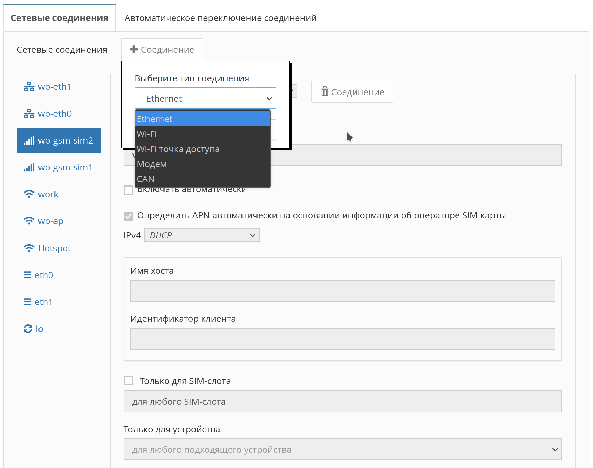

# wb-nm-helper

Сервис предназначен для настройки и управления сетевыми соединениями с помощью [NetworkManager](https://www.networkmanager.dev/docs/) и [ModemManager](https://modemmanager.org/).
Сервис предоставляет web-интерфейс редактирования настроек сетевых соединений совместно с `wb-mqtt-confed` и `wb-mqtt-homeui`.
Можно создавать, удалять и изменять настройки соединений под управлением `NetworkManager`. Соединения, описанные в `/etc/network/interfaces` можно редактировать и удалять.

### Web-интерфейс настройки соединений



### Управление модемами

Управление модемами производит сервис `ModemManager`. Для управления сервисом существует консольное приложение [mmcli](https://www.freedesktop.org/software/ModemManager/man/latest/mmcli.1.html).
После настройки модема через `wb-hwconf-manager`, `ModemManager` определит его наличие в системе. Проверить это можно командой:

```bash
# mmcli -L
    /org/freedesktop/ModemManager1/Modem/0 [INCORPORATED] A7600E-HNVW
```

Текущий статус модема можно получить командой:

```bash
# mmcli -m 0
  -----------------------------
  General  |              path: /org/freedesktop/ModemManager1/Modem/0
           |         device id: 10747f6b4e126264e96a36a1e2897c7e89683bb6
  -----------------------------
  Hardware |      manufacturer: INCORPORATED
           |             model: A7600E-HNVW
           | firmware revision: A39C4B02A7600M7
           |         supported: gsm-umts
           |           current: gsm-umts
           |      equipment id: 861065040060585
  -----------------------------
  System   |            device: /sys/devices/platform/soc/1c1c000.usb/usb3/3-1
           |           drivers: rndis_host, option
           |            plugin: simtech
           |      primary port: ttyUSB2
           |             ports: ttyUSB1 (at), ttyUSB2 (at), usb0 (net)
  -----------------------------
  Status   |             state: failed
           |     failed reason: sim-missing
           |       power state: on
           |    signal quality: 0% (cached)
  -----------------------------
  Modes    |         supported: allowed: any; preferred: none
           |           current: allowed: any; preferred: none
  -----------------------------
  IP       |         supported: ipv4, ipv6, ipv4v6
  -----------------------------
  SIM      |    sim slot paths: slot 1: none (active)
           |                    slot 2: none
```

Модули расширения с модемами для устройств Wiren Board оснащены двумя слотами SIM-карт. Одновременно модем может работать только с одной SIM-картой, питание на вторую не подаётся. По этому, если в неактивный слот вставлена SIM-карта, `ModemManager` не покажет её наличие. Для переключения на второй слот надо выполнить команду:

```bash
# mmcli -m 0 --set-primary-sim-slot=2
successfully requested primary SIM switch in mode
```

`ModemManager` выполнит необходимые действия по переключению и переинициализации модема. Через некоторое время информация о статусе модема обновится:

```bash
# mmcli -L
    /org/freedesktop/ModemManager1/Modem/1 [INCORPORATED] A7600E-HNVW
# mmcli -m 1
  --------------------------------
  General  |                 path: /org/freedesktop/ModemManager1/Modem/1
           |            device id: 10747f6b4e126264e96a36a1e2897c7e89683bb6
  --------------------------------
  Hardware |         manufacturer: INCORPORATED
           |                model: A7600E-HNVW
           |    firmware revision: A39C4B02A7600M7
           |            supported: gsm-umts
           |              current: gsm-umts
           |         equipment id: 861065040060585
  --------------------------------
  System   |               device: /sys/devices/platform/soc/1c1c000.usb/usb3/3-1
           |              drivers: rndis_host, option
           |               plugin: simtech
           |         primary port: ttyUSB2
           |                ports: ttyUSB1 (at), ttyUSB2 (at), usb0 (net)
  --------------------------------
  Status   |       unlock retries: sim-pin (3), sim-puk (10), sim-pin2 (3), sim-puk2 (10)
           |                state: registered
           |          power state: on
           |          access tech: lte
           |       signal quality: 48% (recent)
  --------------------------------
  Modes    |            supported: allowed: any; preferred: none
           |              current: allowed: any; preferred: none
  --------------------------------
  IP       |            supported: ipv4, ipv6, ipv4v6
  --------------------------------
  3GPP     |                 imei: 861065040060585
           |          operator id: 25011
           |        operator name: YOTA
           |         registration: home
  --------------------------------
  3GPP EPS | ue mode of operation: csps-1
  --------------------------------
  SIM      |     primary sim path: /org/freedesktop/ModemManager1/SIM/0
           |       sim slot paths: slot 1: none
           |                       slot 2: /org/freedesktop/ModemManager1/SIM/0 (active)
```

При этом может поменяться номер модема, который используется в запросах `mmcli`.

### Автоматическое переключение между соединениями

Сервис `wb-connection-manager`, входящий в пакет `wb-nm-helper`, позволяет осуществить мониторинг за состоянием выбранных соединений и активировать резервные соединения в случае потери связи через основное.


Корректность работы соединения проверяется посылкой HTTP-запроса по адресу `http://network-test.debian.org/nm`. Проверка производится раз в 5 секунд. Если ответ на запрос не будет получен, сервис будет последовательно активировать менее приоритетные соединения.
Если текущее активное соединение не является наиболее приоритетным, сервис с периодом в 60 секунд будет пытаться активировать более приоритетные соединения. При активации более приоритетного соединения, все менее приоритетные закрываются.
Перед активацией модемного соединения, в настройках которого указан конкретный слот SIM-карты, сервис выполнит запрос к `ModemManager`'у для переключения на требуемый слот.

Файл настройки сервиса `/etc/wb-connection-manager.conf`

```jsonc
{
    // Включение/выключение отладочных сообщений
    "debug": false,

    // Список названий соединений от в порядке убывания приоритета
    "connections": [
        "wb-eth1",
        "wb-gsm-sim1",
        "wb-gsm-sim2"
    ]
}
```

### Скрытие соединения в homeUI

Чтобы сделать соединение недоступным для редактирования из homeUI, необходимо добавить в `.nmconnection`:
```
[user]
wb.read-only=true
```
